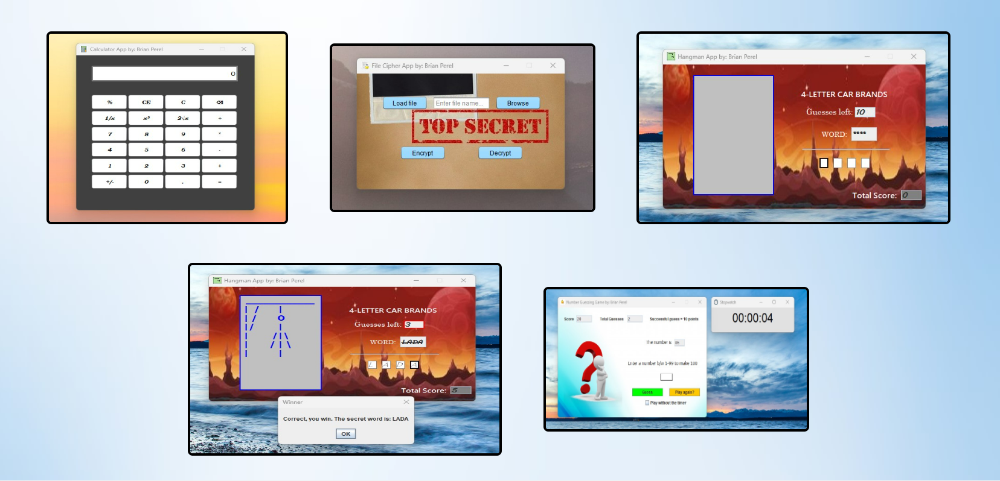
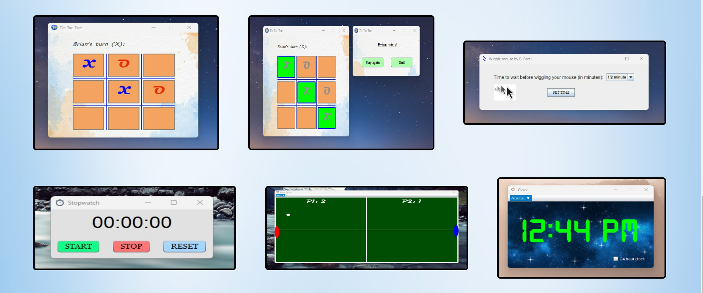

# fun-ops

## Project Description

A collection of all sorts of different Java programs I am making that I find interesting. Project start date: Dec 11, 2020

## Other Notes

* Please comment out taskdef name="launch4j" in build.xml unless you're going to create executables
for the projects through ANT. In that case, make sure to download
(https://sourceforge.net/projects/launch4j/files/launch4j) and paste a copy of the Launch4j folder into the root of the IDE workspace

* List of apps in project: Calculator, Data encryption-decryption, Stop watch, Guessing number game, Hangman, Tic tac toe, Wiggle Mouse, Clock, Ping Pong

## Author

- Owner: Brian Perel

## Contributing

Pull requests are welcome. For major changes, please open an issue first to discuss what you would like to change.

## Sample Screenshots

[Check out the project here on my website](https://brianperel.github.io/side_projects.htm)
